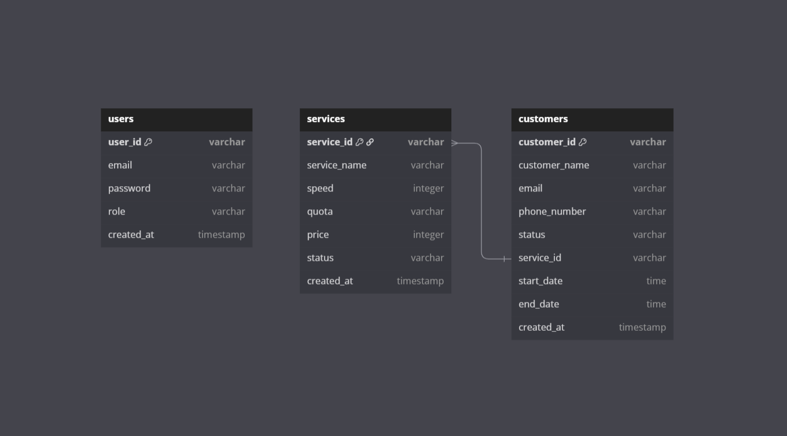

# 🚀 Express API - User, Service, Customer

API sederhana menggunakan Express.js untuk menangani proses otentikasi pengguna, layanan (services), dan pelanggan (customers).

---

## 📁 Struktur Endpoint

### `/users`

Endpoint terkait autentikasi dan informasi pengguna:

- `POST /users/register`  
  Registrasi pengguna baru

- `POST /users/login`  
  Login pengguna

- `GET /users/profile`  
  Mendapatkan data profil pengguna (dilindungi dengan middleware)

- `POST /users/refreshToken`  
  Mendapatkan token JWT baru

---

### `/service`

Endpoint untuk mengelola data layanan:

- `GET /service/`  
  Mendapatkan semua layanan

- `GET /service/:id`  
  Mendapatkan detail layanan berdasarkan ID

- `POST /service/`  
  Menambahkan layanan baru

- `PUT /service/:id`  
  Memperbarui data layanan berdasarkan ID

- `DELETE /service/:id`  
  Menghapus layanan berdasarkan ID

---

### `/customer`

Endpoint untuk mengelola data pelanggan:

- `GET /customer/`  
  Mendapatkan semua pelanggan

- `GET /customer/:id`  
  Mendapatkan detail pelanggan berdasarkan ID

- `POST /customer/`  
  Menambahkan pelanggan baru

- `PUT /customer/:id`  
  Memperbarui data pelanggan berdasarkan ID

- `DELETE /customer/:id`  
  Menghapus pelanggan berdasarkan ID

---

## 📦 Dependencies

Berikut adalah dependencies yang digunakan dalam proyek ini:

- `express` - Framework utama backend
- `bcryptjs` - Enkripsi password
- `jsonwebtoken` - Autentikasi menggunakan JWT
- `uuid` - Menghasilkan ID unik

---

## 🔐 Keamanan

Beberapa middleware keamanan yang digunakan:

- `helmet` untuk menambahkan header keamanan HTTP
- `xss-clean` untuk menghindari input berbahaya
- `cors` diaktifkan untuk mengatur cross-origin access
- Autentikasi menggunakan JWT untuk endpoint tertentu

---

## 🧭 Diagram API



---

## 🗄️ Struktur Database (SQL)

Struktur database disimpan dalam file berikut:

> [📄 query.sql](./query.sql)

---

## 🛠️ Panduan Instalasi

Ikuti langkah-langkah berikut untuk menjalankan proyek ini secara lokal:

### 1. Clone repositori

```bash
git clone https://github.com/username/express-api.git
cd express-api
```

### 2. Install dependencies

Pastikan Node.js telah terpasang di sistem kamu, lalu jalankan:

```bash
npm install
```

### 3. Konfigurasi environment variables

Buat file .env di direktori root dan tambahkan konfigurasi berikut:

```bash
PGUSER=your_database_user
PGHOST=database_host
PGDATABASE=database_name
PGPASSWORD=database_password
PGPORT=posgresql_port
PORT=3000
JWT_SECRET=your_jwt_secret
REFRESH_TOKEN_SECRET=your_refresh_token_secret
```

### 4. Jalankan server

```bash
npm run dev
Server akan berjalan di http://localhost:3000
```

---

## 🔗 Link Terkait

- [GitHub Repository](https://github.com/msuryasyahruli/BE-Customer-Relationship-Management-)
